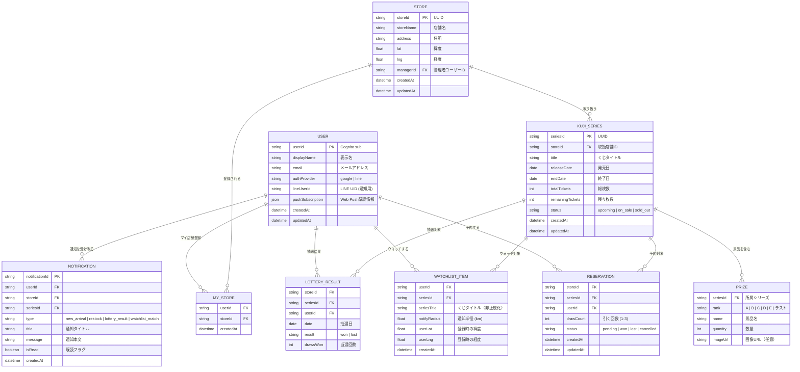
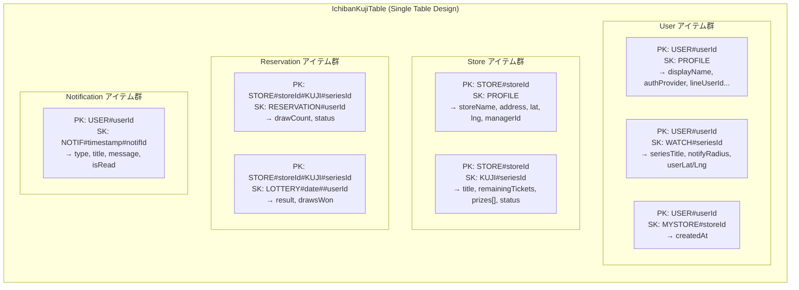

# ER図

## 論理ER図

## DynamoDB 物理テーブル設計

### メインテーブル (IchibanKujiTable)

### GSI (グローバルセカンダリインデックス)

| GSI | PK | SK | 用途 |
|-----|----|----|------|
| GSI1 | `SERIES#{seriesId}` | `WATCH#{userId}` | シリーズ → ウォッチしているユーザー一覧 |
| GSI2 | `SERIES#{seriesId}` | `STORE#{storeId}` | シリーズ → 取扱店舗一覧 |
| GSI3 | `USER#{userId}` | `RESERVATION#{storeId}##seriesId` | ユーザー → 全予約一覧 |

### Geoテーブル (StoreGeoTable)

| Key | Type | 説明 |
|-----|------|------|
| hashKey | NUMBER | ジオハッシュ（dynamodb-geo-v3） |
| rangeKey | STRING | storeId |
| geoJson | STRING | `{"type":"Point","coordinates":[lng,lat]}` |
| storeName | STRING | 店舗名（非正規化） |
| address | STRING | 住所（非正規化） |
