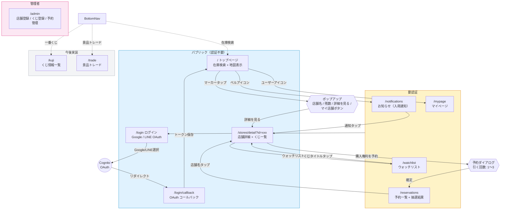

# 画面遷移図

## 画面一覧

| 画面 | パス | 認証 | 主な機能 |
|------|------|------|---------|
| トップ（検索） | `/` | 不要 | 景品名検索、地図上に店舗マーカー表示、マイ店舗登録 |
| ログイン | `/login` | 不要 | Google / LINE OAuth ログイン |
| OAuthコールバック | `/login/callback` | 不要 | トークン取得・保存後リダイレクト |
| 店舗詳細 | `/stores/detail?id=xxx` | 不要（予約時ログイン） | くじ一覧、残数、予約ボタン、ウォッチリスト追加 |
| お知らせ | `/notifications` | 必要 | マイ店舗の入荷通知・在庫復活通知 |
| 予約一覧 | `/reservations` | 必要 | 予約状況、抽選結果（当選/落選） |
| ウォッチリスト | `/watchlist` | 必要 | 気になるくじの通知設定（半径指定） |
| マイページ | `/mypage` | 必要 | プロフィール、マイ店舗管理 |
| くじ情報 | `/kuji` | 不要 | くじ一覧・検索（今後実装） |
| 景品トレード | `/trade` | 必要 | 景品交換マッチング（今後実装） |
| 管理画面 | `/admin` | 必要(管理者) | 店舗登録、くじ登録、予約管理 |
