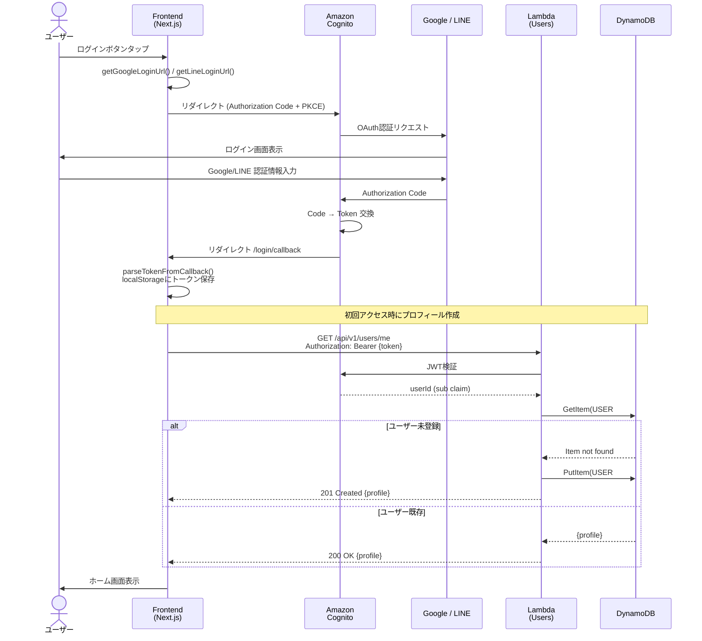
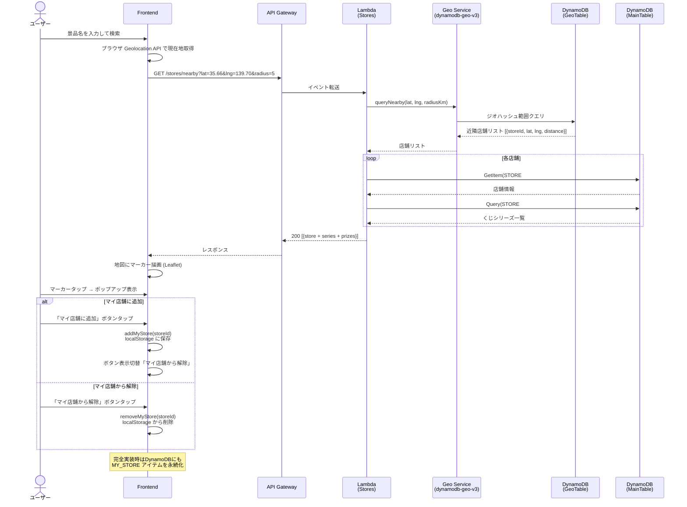
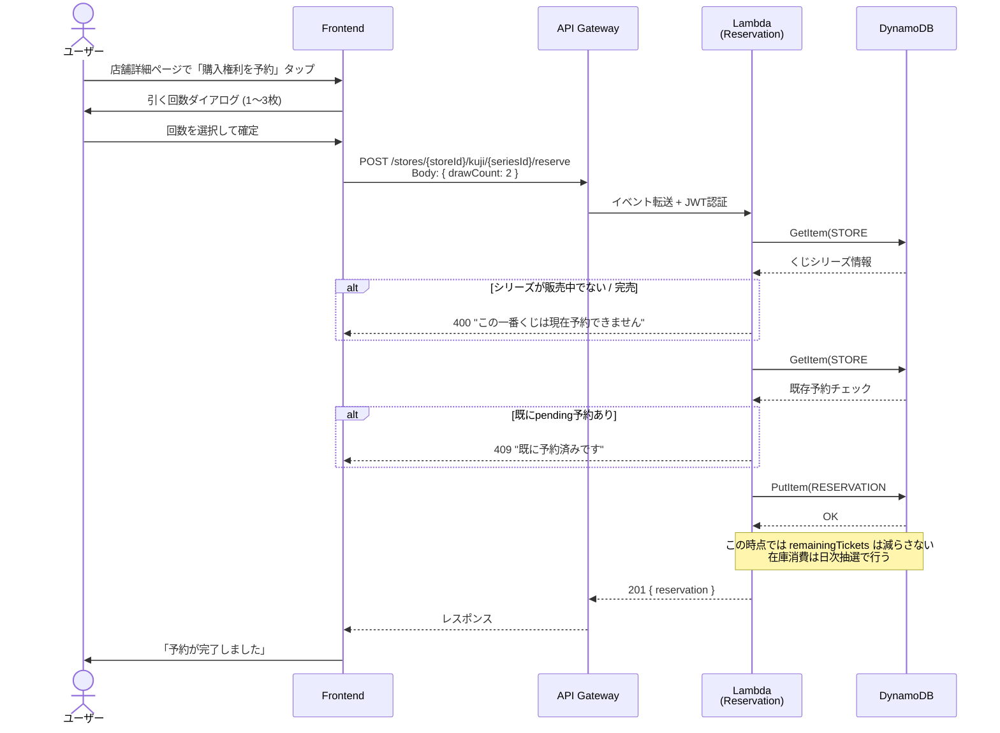
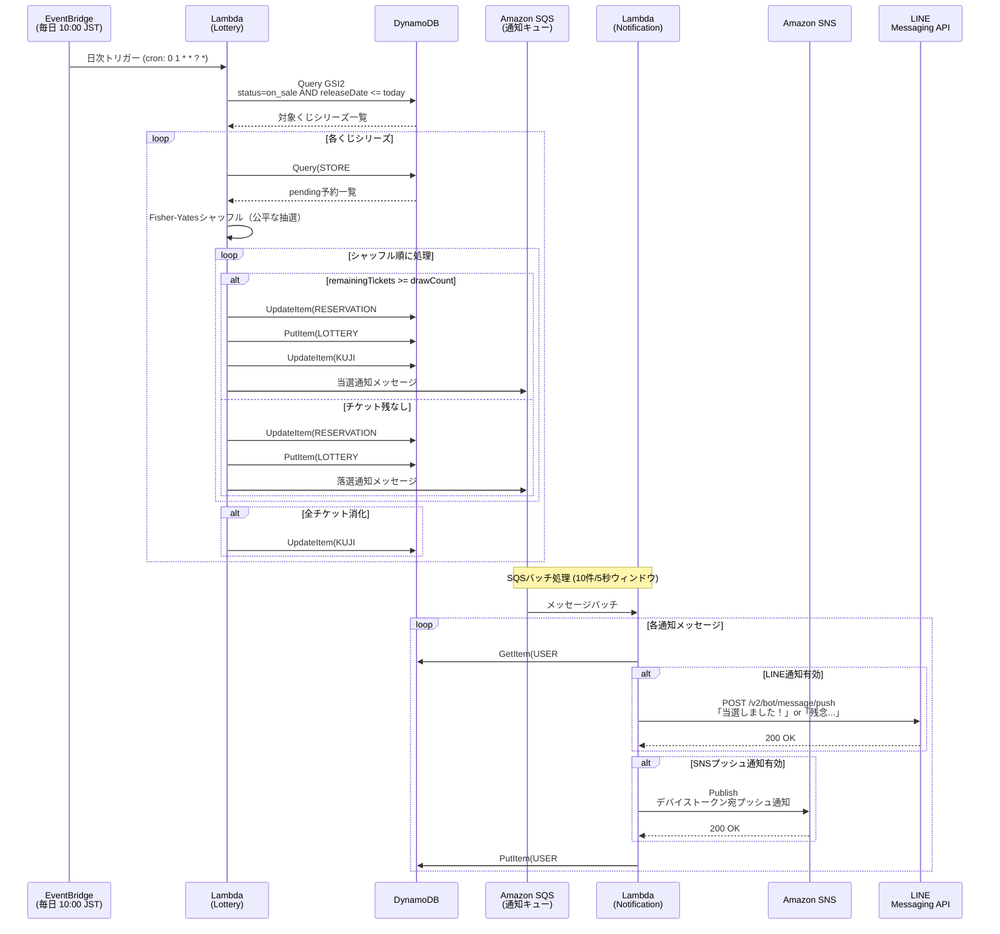
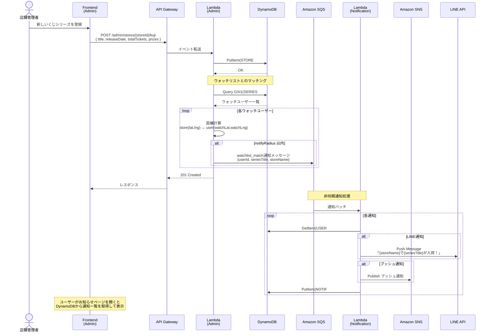
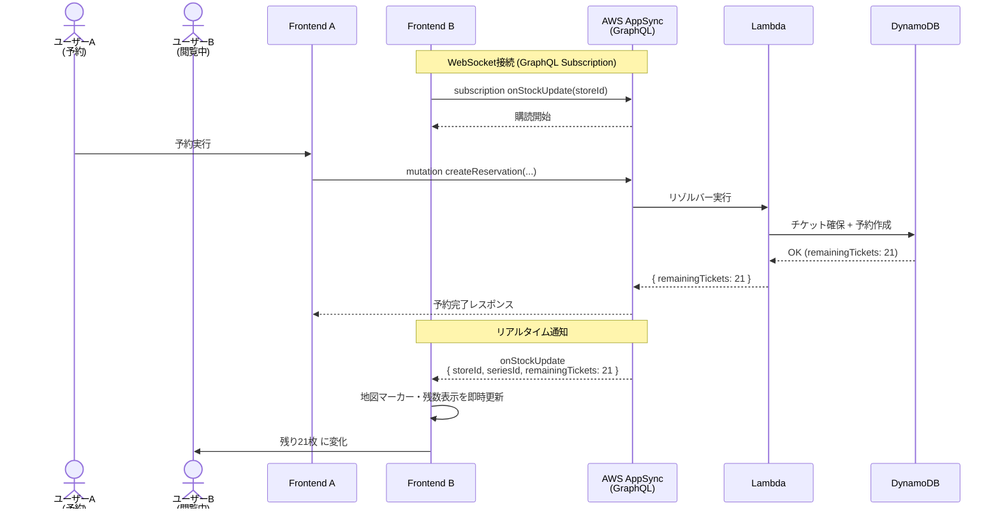

# シーケンス図

## 1. ユーザー認証フロー (OAuth + Cognito)

```mermaid
sequenceDiagram
    actor User as ユーザー
    participant FE as Frontend<br/>(Next.js)
    participant Cognito as Amazon<br/>Cognito
    participant IdP as Google / LINE
    participant Lambda as Lambda<br/>(Users)
    participant DDB as DynamoDB

    User->>FE: ログインボタンタップ
    FE->>FE: getGoogleLoginUrl() / getLineLoginUrl()
    FE->>Cognito: リダイレクト (Authorization Code + PKCE)
    Cognito->>IdP: OAuth認証リクエスト
    IdP->>User: ログイン画面表示
    User->>IdP: Google/LINE 認証情報入力
    IdP->>Cognito: Authorization Code
    Cognito->>Cognito: Code → Token 交換
    Cognito->>FE: リダイレクト /login/callback#id_token=xxx
    FE->>FE: parseTokenFromCallback()<br/>localStorageにトークン保存

    Note over FE,DDB: 初回アクセス時にプロフィール作成

    FE->>Lambda: GET /api/v1/users/me<br/>Authorization: Bearer {token}
    Lambda->>Cognito: JWT検証
    Cognito-->>Lambda: userId (sub claim)
    Lambda->>DDB: GetItem(USER#{userId}, PROFILE)
    alt ユーザー未登録
        DDB-->>Lambda: Item not found
        Lambda->>DDB: PutItem(USER#{userId}, PROFILE, ...)
        Lambda-->>FE: 201 Created {profile}
    else ユーザー既存
        DDB-->>Lambda: {profile}
        Lambda-->>FE: 200 OK {profile}
    end
    FE->>User: ホーム画面表示
```

## 2. 店舗検索 + マイ店舗登録フロー

```mermaid
sequenceDiagram
    actor User as ユーザー
    participant FE as Frontend
    participant APIGW as API Gateway
    participant Lambda as Lambda<br/>(Stores)
    participant Geo as Geo Service<br/>(dynamodb-geo-v3)
    participant GeoTable as DynamoDB<br/>(GeoTable)
    participant MainTable as DynamoDB<br/>(MainTable)

    User->>FE: 景品名を入力して検索
    FE->>FE: ブラウザ Geolocation API で現在地取得

    FE->>APIGW: GET /stores/nearby?lat=35.66&lng=139.70&radius=5
    APIGW->>Lambda: イベント転送
    Lambda->>Geo: queryNearby(lat, lng, radiusKm)
    Geo->>GeoTable: ジオハッシュ範囲クエリ
    GeoTable-->>Geo: 近隣店舗リスト [{storeId, lat, lng, distance}]
    Geo-->>Lambda: 店舗リスト

    loop 各店舗
        Lambda->>MainTable: GetItem(STORE#{storeId}, PROFILE)
        MainTable-->>Lambda: 店舗情報
        Lambda->>MainTable: Query(STORE#{storeId}, begins_with KUJI#)
        MainTable-->>Lambda: くじシリーズ一覧
    end

    Lambda-->>APIGW: 200 [{store + series + prizes}]
    APIGW-->>FE: レスポンス

    FE->>FE: 地図にマーカー描画 (Leaflet)
    User->>FE: マーカータップ → ポップアップ表示

    alt マイ店舗に追加
        User->>FE: 「マイ店舗に追加」ボタンタップ
        FE->>FE: addMyStore(storeId)<br/>localStorage に保存
        FE->>FE: ボタン表示切替「マイ店舗から解除」
    else マイ店舗から解除
        User->>FE: 「マイ店舗から解除」ボタンタップ
        FE->>FE: removeMyStore(storeId)<br/>localStorage から削除
    end

    Note over FE: 完全実装時はDynamoDBにも<br/>MY_STORE アイテムを永続化
```

## 3. 予約フロー

```mermaid
sequenceDiagram
    actor User as ユーザー
    participant FE as Frontend
    participant APIGW as API Gateway
    participant Lambda as Lambda<br/>(Reservation)
    participant DDB as DynamoDB

    User->>FE: 店舗詳細ページで「購入権利を予約」タップ
    FE->>User: 引く回数ダイアログ (1〜3枚)
    User->>FE: 回数を選択して確定

    FE->>APIGW: POST /stores/{storeId}/kuji/{seriesId}/reserve<br/>Body: { drawCount: 2 }
    APIGW->>Lambda: イベント転送 + JWT認証

    Lambda->>DDB: GetItem(STORE#{storeId}, KUJI#{seriesId})
    DDB-->>Lambda: くじシリーズ情報

    alt シリーズが販売中でない / 完売
        Lambda-->>FE: 400 "この一番くじは現在予約できません"
    end

    Lambda->>DDB: GetItem(STORE#...#KUJI#..., RESERVATION#{userId})
    DDB-->>Lambda: 既存予約チェック

    alt 既にpending予約あり
        Lambda-->>FE: 409 "既に予約済みです"
    end

    Lambda->>DDB: PutItem(RESERVATION#{userId})<br/>status: pending, drawCount: 2
    DDB-->>Lambda: OK
    Note over Lambda,DDB: この時点では remainingTickets は減らさない<br/>在庫消費は日次抽選で行う

    Lambda-->>APIGW: 201 { reservation }
    APIGW-->>FE: レスポンス
    FE->>User: 「予約が完了しました」
```

## 4. 毎日の抽選フロー

```mermaid
sequenceDiagram
    participant EB as EventBridge<br/>(毎日 10:00 JST)
    participant LotteryLambda as Lambda<br/>(Lottery)
    participant DDB as DynamoDB
    participant SQS as Amazon SQS<br/>(通知キュー)
    participant NotifLambda as Lambda<br/>(Notification)
    participant SNS as Amazon SNS
    participant LINE as LINE<br/>Messaging API

    EB->>LotteryLambda: 日次トリガー (cron: 0 1 * * ? *)

    LotteryLambda->>DDB: Query GSI2<br/>status=on_sale AND releaseDate <= today
    DDB-->>LotteryLambda: 対象くじシリーズ一覧

    loop 各くじシリーズ
        LotteryLambda->>DDB: Query(STORE#...#KUJI#..., begins_with RESERVATION#)<br/>status = pending
        DDB-->>LotteryLambda: pending予約一覧

        LotteryLambda->>LotteryLambda: Fisher-Yatesシャッフル（公平な抽選）

        loop シャッフル順に処理
            alt remainingTickets >= drawCount
                LotteryLambda->>DDB: UpdateItem(RESERVATION#userId)<br/>status → won
                LotteryLambda->>DDB: PutItem(LOTTERY#date##userId)<br/>result: won, drawsWon: N
                LotteryLambda->>DDB: UpdateItem(KUJI#seriesId)<br/>remainingTickets -= drawCount
                LotteryLambda->>SQS: 当選通知メッセージ
            else チケット残なし
                LotteryLambda->>DDB: UpdateItem(RESERVATION#userId)<br/>status → lost
                LotteryLambda->>DDB: PutItem(LOTTERY#date##userId)<br/>result: lost
                LotteryLambda->>SQS: 落選通知メッセージ
            end
        end

        alt 全チケット消化
            LotteryLambda->>DDB: UpdateItem(KUJI#seriesId)<br/>status → sold_out
        end
    end

    Note over SQS,NotifLambda: SQSバッチ処理 (10件/5秒ウィンドウ)

    SQS->>NotifLambda: メッセージバッチ

    loop 各通知メッセージ
        NotifLambda->>DDB: GetItem(USER#{userId})<br/>通知設定取得

        alt LINE通知有効
            NotifLambda->>LINE: POST /v2/bot/message/push<br/>「当選しました！」or「残念...」
            LINE-->>NotifLambda: 200 OK
        end

        alt SNSプッシュ通知有効
            NotifLambda->>SNS: Publish<br/>デバイストークン宛プッシュ通知
            SNS-->>NotifLambda: 200 OK
        end

        NotifLambda->>DDB: PutItem(USER#{userId}, NOTIF#...)<br/>アプリ内通知として保存
    end
```

## 5. 入荷通知フロー (ウォッチリスト連動)

```mermaid
sequenceDiagram
    actor Admin as 店舗管理者
    participant FE as Frontend<br/>(Admin)
    participant APIGW as API Gateway
    participant Lambda as Lambda<br/>(Admin)
    participant DDB as DynamoDB
    participant SQS as Amazon SQS
    participant NotifLambda as Lambda<br/>(Notification)
    participant SNS as Amazon SNS
    participant LINE as LINE API

    Admin->>FE: 新しいくじシリーズを登録
    FE->>APIGW: POST /admin/stores/{storeId}/kuji<br/>{ title, releaseDate, totalTickets, prizes }
    APIGW->>Lambda: イベント転送

    Lambda->>DDB: PutItem(STORE#{storeId}, KUJI#{seriesId})
    DDB-->>Lambda: OK

    Note over Lambda,DDB: ウォッチリストとのマッチング

    Lambda->>DDB: Query GSI1(SERIES#{seriesId})<br/>ウォッチしているユーザー取得
    DDB-->>Lambda: ウォッチユーザー一覧

    loop 各ウォッチユーザー
        Lambda->>Lambda: 距離計算<br/>store(lat,lng) ↔ user(watchLat,watchLng)

        alt notifyRadius 以内
            Lambda->>SQS: watchlist_match通知メッセージ<br/>{userId, seriesTitle, storeName}
        end
    end

    Lambda-->>APIGW: 201 Created
    APIGW-->>FE: レスポンス

    Note over SQS,NotifLambda: 非同期通知処理

    SQS->>NotifLambda: 通知バッチ

    loop 各通知
        NotifLambda->>DDB: GetItem(USER#{userId})

        alt LINE通知
            NotifLambda->>LINE: Push Message<br/>「{storeName}で{seriesTitle}が入荷！」
        end

        alt プッシュ通知
            NotifLambda->>SNS: Publish プッシュ通知
        end

        NotifLambda->>DDB: PutItem(NOTIF#...)<br/>アプリ内通知保存
    end

    Note over FE: ユーザーがお知らせページを開くと<br/>DynamoDBから通知一覧を取得して表示
```

## 6. AppSync リアルタイム在庫更新 (完全版での追加)

```mermaid
sequenceDiagram
    actor UserA as ユーザーA<br/>(予約)
    actor UserB as ユーザーB<br/>(閲覧中)
    participant FE_A as Frontend A
    participant FE_B as Frontend B
    participant AppSync as AWS AppSync<br/>(GraphQL)
    participant Lambda as Lambda
    participant DDB as DynamoDB

    Note over FE_B,AppSync: WebSocket接続 (GraphQL Subscription)
    FE_B->>AppSync: subscription onStockUpdate(storeId)
    AppSync-->>FE_B: 購読開始

    UserA->>FE_A: 予約実行
    FE_A->>AppSync: mutation createReservation(...)
    AppSync->>Lambda: リゾルバー実行
    Lambda->>DDB: チケット確保 + 予約作成
    DDB-->>Lambda: OK (remainingTickets: 21)
    Lambda-->>AppSync: { remainingTickets: 21 }

    AppSync-->>FE_A: 予約完了レスポンス

    Note over AppSync,FE_B: リアルタイム通知
    AppSync-->>FE_B: onStockUpdate<br/>{ storeId, seriesId, remainingTickets: 21 }

    FE_B->>FE_B: 地図マーカー・残数表示を即時更新
    FE_B->>UserB: 残り21枚 に変化
```
